## Project: Perception Pick & Place

# Project Setup
For this setup, catkin_ws is the name of active ROS Workspace, if your workspace name is different, change the commands accordingly
If you do not have an active ROS workspace, you can create one by:

```sh
$ mkdir -p ~/catkin_ws/src
$ cd ~/catkin_ws/
$ catkin_make
```

Now that you have a workspace, clone or download this repo into the src directory of your workspace:
```sh
$ cd ~/catkin_ws/src
$ git clone https://github.com/nick-zanobini/RoboND-Perception-Project.git
```
### Note: If you have the Kinematics Pick and Place project in the same ROS Workspace as this project, please remove the 'gazebo_grasp_plugin' directory from the `RoboND-Perception-Project/` directory otherwise ignore this note. 

Now install missing dependencies using rosdep install:
```sh
$ cd ~/catkin_ws
$ rosdep install --from-paths src --ignore-src --rosdistro=kinetic -y
```
Build the project:
```sh
$ cd ~/catkin_ws
$ catkin_make
```
Add following to your .bashrc file
```
export GAZEBO_MODEL_PATH=~/catkin_ws/src/RoboND-Perception-Project/pr2_robot/models:$GAZEBO_MODEL_PATH
```

If you haven’t already, following line can be added to your .bashrc to auto-source all new terminals
```
source ~/catkin_ws/devel/setup.bash
```

You can launch the project scenario like this:
```sh
$ roslaunch pr2_robot pick_place_project.launch
```

# Required Steps for a Passing Submission:
1. Extract features and train an SVM model on new objects (see `pick_list_*.yaml` in `/pr2_robot/config/` for the list of models you'll be trying to identify).
    * I binned each image into 32 bins after converting to the HSV color space and extracted features from 5000 images per item in `pick_list_3.yaml`. I figured that all the items are in the largest pick list so it will work on the two previous lists.
2. Write a ROS node and subscribe to `/pr2/world/points` topic. This topic contains noisy point cloud data that you must work with.
3. Use filtering and RANSAC plane fitting to isolate the objects of interest from the rest of the scene.
4. Apply Euclidean clustering to create separate clusters for individual items.
5. Perform object recognition on these objects and assign them labels (markers in RViz).
6. Calculate the centroid (average in x, y and z) of the set of points belonging to that each object.
7. Create ROS messages containing the details of each object (name, pick_pose, etc.) and write these messages out to `.yaml` files, one for each of the 3 scenarios (`test1-3.world` in `/pr2_robot/worlds/`).  See the example `output.yaml` for details on what the output should look like.  
8. Submit a link to your GitHub repo for the project or the Python code for your perception pipeline and your output `.yaml` files (3 `.yaml` files, one for each test world).  You must have correctly identified 100% of objects from `pick_list_1.yaml` for `test1.world`, 80% of items from `pick_list_2.yaml` for `test2.world` and 75% of items from `pick_list_3.yaml` in `test3.world`.
9. Congratulations!  Your Done!

# Extra Challenges: Complete the Pick & Place
7. To create a collision map, publish a point cloud to the `/pr2/3d_map/points` topic and make sure you change the `point_cloud_topic` to `/pr2/3d_map/points` in `sensors.yaml` in the `/pr2_robot/config/` directory. This topic is read by Moveit!, which uses this point cloud input to generate a collision map, allowing the robot to plan its trajectory.  Keep in mind that later when you go to pick up an object, you must first remove it from this point cloud so it is removed from the collision map!
8. Rotate the robot to generate collision map of table sides. This can be accomplished by publishing joint angle value(in radians) to `/pr2/world_joint_controller/command`
9. Rotate the robot back to its original state.
10. Create a ROS Client for the “pick_place_routine” rosservice.  In the required steps above, you already created the messages you need to use this service. Checkout the [PickPlace.srv](https://github.com/udacity/RoboND-Perception-Project/tree/master/pr2_robot/srv) file to find out what arguments you must pass to this service.
11. If everything was done correctly, when you pass the appropriate messages to the `pick_place_routine` service, the selected arm will perform pick and place operation and display trajectory in the RViz window
12. Place all the objects from your pick list in their respective dropoff box and you have completed the challenge!
13. Looking for a bigger challenge?  Load up the `challenge.world` scenario and see if you can get your perception pipeline working there!

## [Rubric](https://review.udacity.com/#!/rubrics/1067/view) Points
### Here I will consider the rubric points individually and describe how I addressed each point in my implementation.  

### Exercise 1, 2 and 3 pipeline implemented
#### 1. Complete Exercise 1 steps. Pipeline for filtering and RANSAC plane fitting implemented.
* Start with World 2: 

    Registered Points |  
    :-------------------------:|
    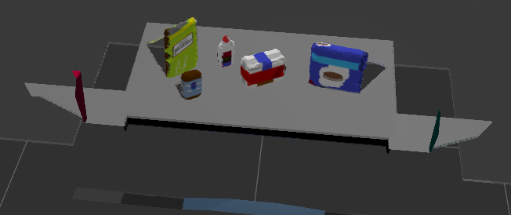  |  

* Filter noise with `statistical_outlier_filter`

    Unfiltered Point Cloud             |  Filtered Point Cloud
    :-------------------------:|:-------------------------:
    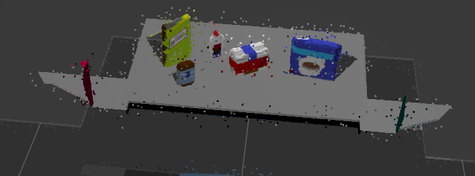  |  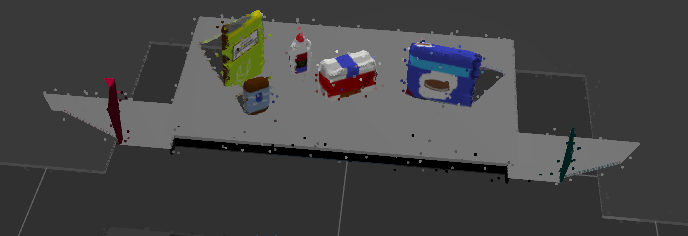

* Downsample the filtered point cloud with the `voxel_grid_filter` so that each cube with the shape `LEAF_SIZE x LEAF_SIZE x LEAF_SIZE` is represented by the centroid of that cube.

* Filter out any data outside the region of interest (The objects on the table and the table) with a `passthrough_filter` in both the `z` and `x` axes 
    
    Parameter | Value
    :--------:|:--------:
    Voxel Filter: LEAF_SIZE | 0.01
    Passthrough Filter (z): axis min | 0.609
    Passthrough Filter (z): axis max | 1.4
    Passthrough Filter (x): axis min | -0.50
    Passthrough Filter (x): axis max | 0.50
    RANSAC Segmentation: max distance | 0.01
    
    * False positive detections without the x-axis filter.
    
        Bins Detected as Objects |
        :-------------------------:|
        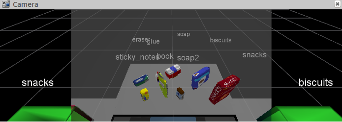  |  
    
* Extract inliers (objects on the table) and outliers (table) using the RANSAC Plane Segmentation

    Inliers (Objects)             |  Outliers (Table)
    :-------------------------:|:-------------------------:
    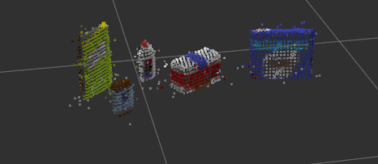  |  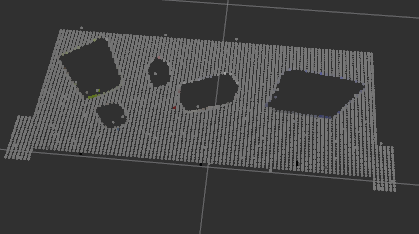

#### 2. Complete Exercise 2 steps: Pipeline including clustering for segmentation implemented.  
* Segment each object using Euclidean Clustering
    * My parameters were: 
    
    Parameter | Value
    :--------:|:--------:
    ClusterTolerance | 0.014
    MinClusterSize | 20
    MaxClusterSize | 2000
 
    Euclidean Clustered Objects |
    :-------------------------:|
    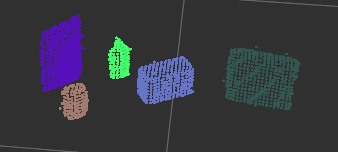  |

#### 3. Complete Exercise 3 Steps.  Features extracted and SVM trained.  Object recognition implemented.

* Here are the parameters I used to capture features and train my model: 

    Parameter | Value
    :--------:|:--------:
    Pictures | 10,000
    Bins (Color & Normals) | 64
    Color Space | HSV
    Total Features | 80,000
    
    Model Training Output |
    :-------------------------:|
    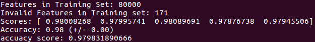  |
    
    Confusion Matrix (Not Normalized) |  Confusion Matrix (Normalized)
    :-------------------------:|:-------------------------:
    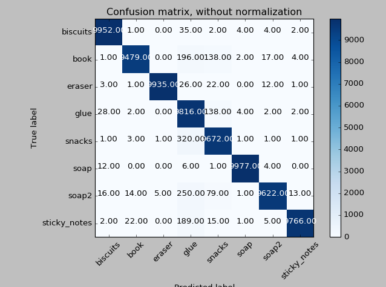  |  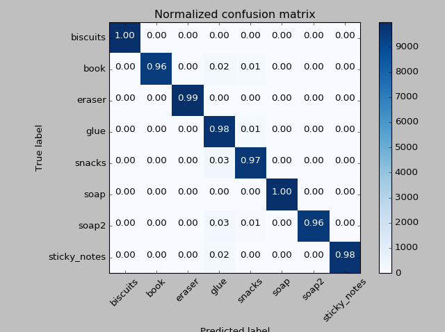

	Model Training Output |
    :-------------------------:|
    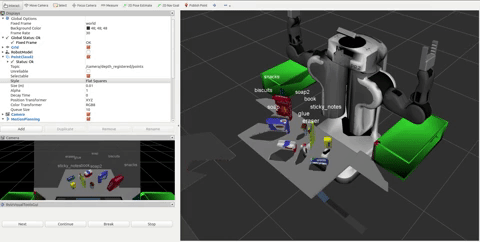  |


#### 4. Output the correctly identified objects to the corresponding `.yaml` file.

    These can be found in the root directory of the project.


